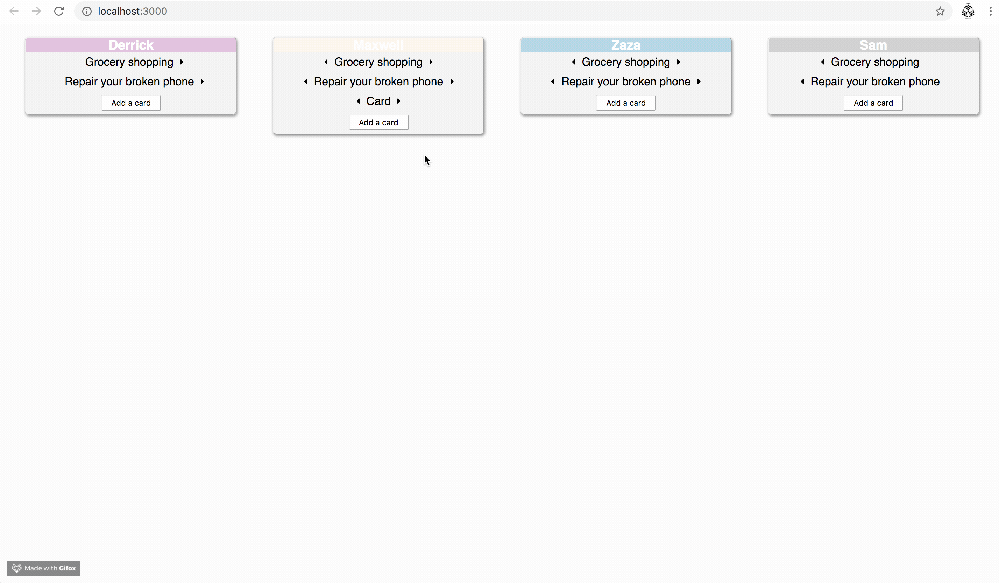
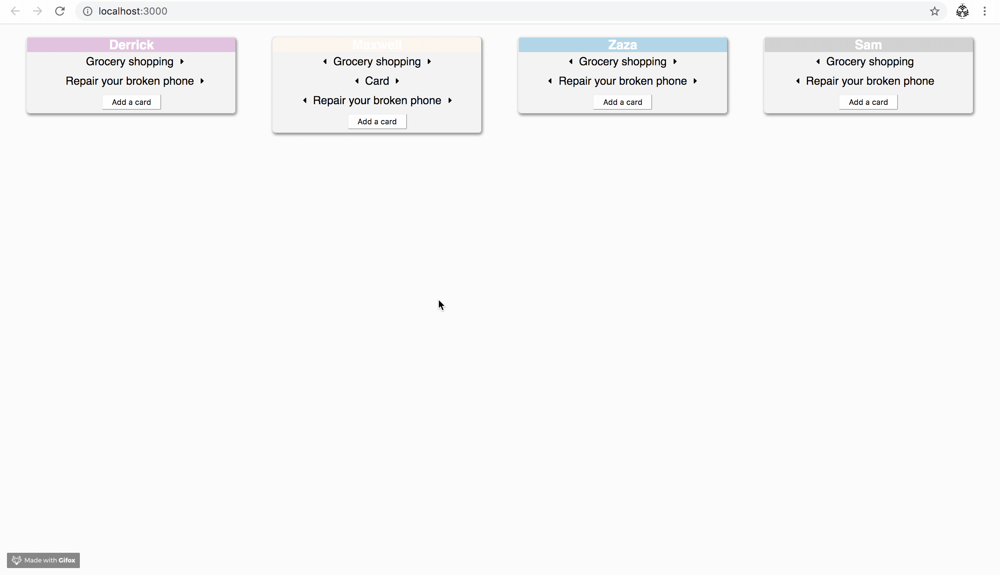
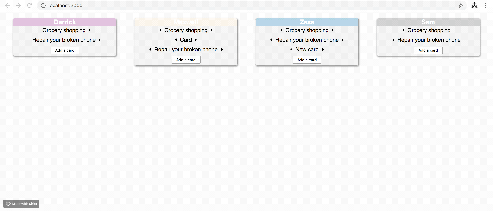

## Requirements

Node.js + (npm or yarn)

## Setup

```
git clone git@github.com:joewstroman/frello.git
cd frello
npm install
npm start
```

or

```
git clone git@github.com:joewstroman/frello.git
cd frello
npm install yarn
yarn install
yarn start
```








